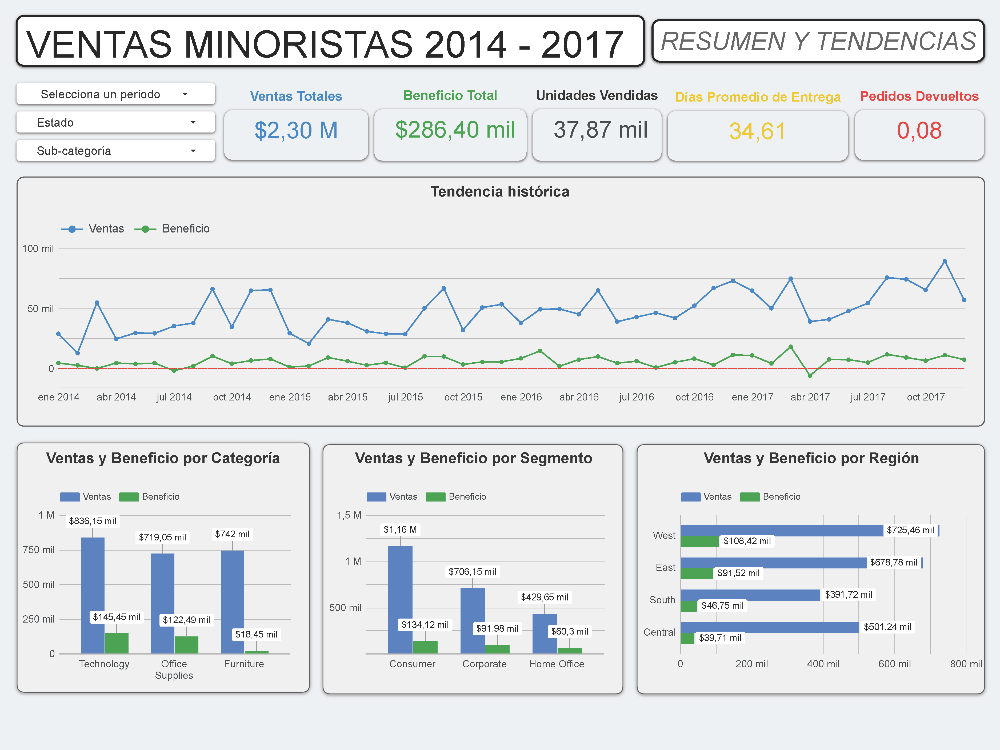
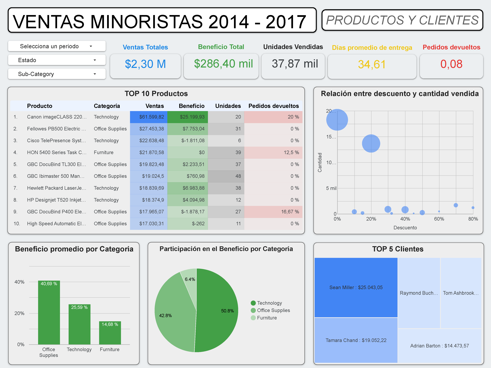
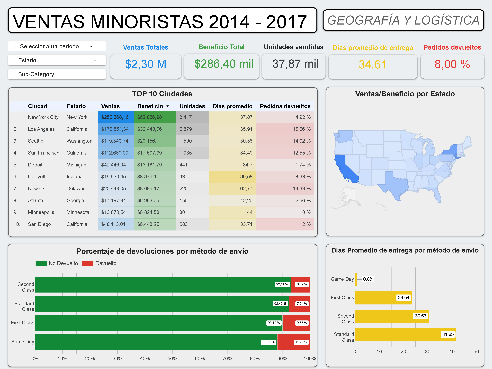

# Supply Chain & Sales Analytics — Looker Studio Dashboard

## Project Description
This Business Intelligence project transforms complex, unstructured supply chain and retail sales data (spanning 2014–2017) into a high-impact visual analytics tool. Using the Google Workspace ecosystem, the final 3-page interactive dashboard enables stakeholders to track historical trends, isolate product profit leakage, and monitor logistic efficiency metrics.

---

## Technical Stack & Methodology
* **Data Source & Pre-processing:** Managed, cleaned, and structured the raw datasets natively within Google Sheets to ensure absolute data consistency.
* **Calculated Fields & Metrics:** Implemented custom calculated fields directly in Looker Studio to model operational KPIs, regional margins, and product performance analytics.
* **UI/UX Dashboard Architecture:** Designed an intuitive multi-page layout utilizing unified corporate branding, custom filters, and dynamic breakdowns for high-level management review.

---

## Dashboard Insights & Architecture

### 1. Executive Summary & Historical Trends
Tracks macro business markers—including $2.30M in Total Sales and $286.40K in Total Benefit—coupled with a timeline showing monthly revenue vs. profitability spikes.

### 2. Product Integrity & Customer Breakdown
Features a deep-dive scatter plot comparing discounts against units sold, alongside automatic performance tables tracking the top 10 products and rankings of high-value clients.

### 3. Geographic Allocation & Logistics Efficiency
Integrates a live United States heatmap for profit distribution alongside specific logistics metrics, such as average delivery days grouped by shipping method and product return rates.

---

## Repository Contents
* `historical_trends.png`: Dashboard overview focused on sales timelines and category performance.
* `products_customers.png`: Product scatter plot analysis and client profitability rankings.
* `geography_logistics.png`: Geographic state map and shipping performance logistics charts.

## Interactive Live Access
You can interact with the live, fully functional Business Intelligence report here:
👉 [Explore the Interactive Looker Studio Dashboard](https://datastudio.google.com/reporting/3aaa7d06-0f49-4cca-8957-634396fc3636)

## Source Dataset
Data obtained from Kaggle (Supply Chain and Retail Sales Public Datasets).
